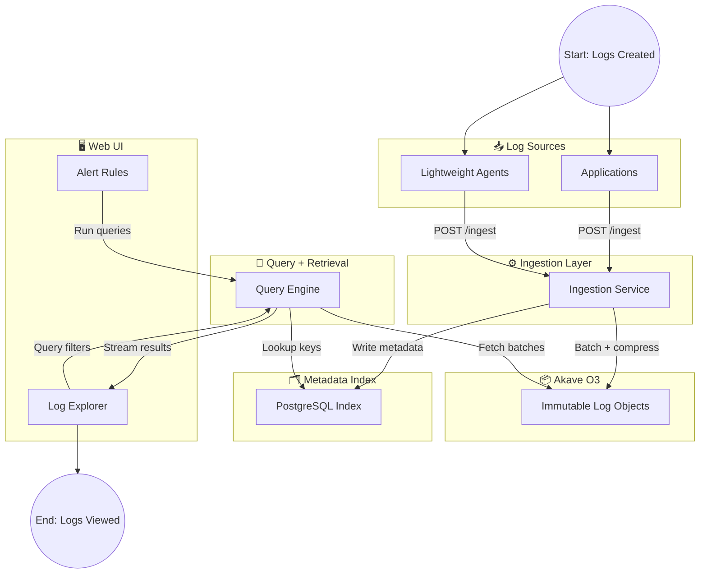
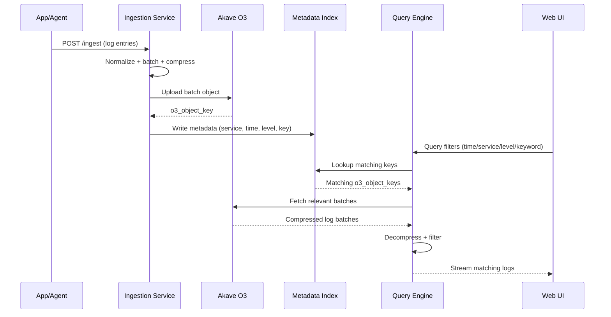

# AkaveLog: Decentralized Log Ingestion, Storage, and Visualization using Akave O3

**Status**: Ready for review
**Contributor**: anuragShingare30, Chayan Das 
**Date**: February 4, 2026
**Note:** Open for potential collaborators


**AkaveLog is a decentralized logging platform that ingests logs via a lightweight service, stores them immutably in Akave O3, and enables fast querying through metadata indexing and Visualized through a web-based UI with filtering and alerting features**


## Brief Problem Statement

Modern log management systems like **Graylog** and **ELK Stack** are built on centralized storage and compute-heavy infrastructure. As log volumes scale, teams encounter:

- **Rising Costs** — Storage and compute expenses grow linearly with log volume
- **Operational Complexity** — Managing clusters, shards, and retention policies adds overhead
- **Vendor Lock-In** — Migrating between platforms is costly and time-consuming
- **Limited Transparency** — Users have little visibility into how logs are stored, retained, or verified

> There is a clear need for a **cost-efficient, scalable, and transparent** log storage solution that decouples log ingestion and visualization from centralized storage backends.


## Objective

Build a **Graylog-inspired, full-stack logging platform** where log data is:

- **Ingested** — Via a lightweight, stateless service accepting logs over HTTP
- **Stored** — Persisted immutably in **Akave O3** as compressed, content-addressed objects
- **Indexed** — Metadata stored separately for fast discovery without duplicating raw logs
- **Visualized** — Queried and explored through a web-based UI with filtering and alerting

> This project validates **Akave O3** as a durable, decentralized backend for large-scale log storage workloads.


## Scope

### What it does!!!

- **Ingest logs** via a lightweight HTTP/agent-based service
- **Store logs immutably** in Akave O3 as compressed objects
- **Index metadata** (timestamp, service, level, tags) for fast discovery
- **Query and visualize logs** in a web UI with:
   - Time-range filters
   - Full-text and field-based search
   - Basic alert rules (keyword or threshold)
- **End-to-end demo** that shows real log streams from ingestion -> storage -> UI


### What it does not do!!!

- **Full Graylog parity** or enterprise-grade features
- **Advanced RBAC / SSO** or complex enterprise authentication
- **Hard real-time streaming guarantees** (near real-time only)


## Intended Users/ ICP

- Infrastructure and DevOps teams
- Blockchain node operators
- Open-source projects with high log volume
- Cost-sensitive startups and protocols


## High-Level Architecture

**AkaveLog uses a lightweight ingestion service and metadata index to store immutable logs in Akave O3 and retrieve them on demand through a query engine and web-based log explorer**

> Think "Graylog with decentralized storage—logs are ingested, indexed, and visualized while raw data lives immutably in Akave O3"


### Log Ingestion Service (Go)

**A lightweight, stateless service in Go responsible for accepting logs from users and services, normalizing them, and preparing batches for durable storage in Akave O3.**


**Core Capabilities:**

- **Log Acceptance** — Receives logs via `POST /ingest` endpoint or lightweight agents deployed alongside user applications
- **Field Normalization** — Standardizes log fields (timestamp, service, level, tags, message) into a consistent schema before storage
- **Batch Aggregation** — Buffers incoming logs in memory and groups them by batch size or time threshold
- **Compression** — Compresses batched logs before uploading to Akave O3, reducing storage costs and transfer time
- **Handoff to Storage** — Uploads compressed log batches to Akave O3 and receives object keys for indexing


**Example Workflow:**

1. User application sends log entry to `POST /ingest`
2. Ingestion service buffers log in memory queue
3. When batch threshold reached (size or time):
   - Logs serialized and compressed
   - Batch uploaded to Akave O3 -> receives `o3_object_key`
4. Metadata record written to index `(timestamp range, service, level, O3 key)`
5. Acknowledgment returned to client


### Storage Layer (Akave O3)

**The durable, decentralized source of truth for all raw log data. Akave O3 serves as an immutable, cost-efficient object store that decouples log persistence from compute and querying.**


**Core Capabilities:**

- **Immutable Object Storage** — Stores compressed log batches as immutable objects, ensuring logs cannot be tampered with after ingestion
- **Low-Cost Retention** — Enables long-term log retention at significantly lower costs compared to centralized storage solutions
- **Decoupled Architecture** — Separates storage from indexing and querying, allowing each layer to scale independently
- **Content Addressability** — Each log batch receives a unique object key for reliable retrieval
- **Verifiable Storage** — Logs stored in Akave O3 are independently verifiable and auditable


**Example Workflow:**

1. Ingestion service uploads compressed log batch to Akave O3
2. Akave O3 returns object reference `(key + checksum)`
3. Raw logs are now immutable, retrievable by key, and verifiable
4. Object key passed to `metadata indexing layer` for fast discovery

> **Note:** Akave O3 never performs querying, it only stores and retrieves data. All search logic lives in the Query Engine.


### Metadata Indexing Layer

**A lightweight index layer that enables fast log discovery without duplicating raw log data. Maps searchable metadata fields to Akave O3 object references.**


**Core Capabilities:**

- **Metadata Extraction** — Extracts key fields from each log batch: `{timestamp range, service name, log levels, tags, and O3 object key}`
- **Index Storage** — Stores metadata records in PostgreSQL with indexing on `{time, service, and level columns}`
- **Object Key Mapping** — Maintains mapping between searchable metadata and corresponding Akave O3 object keys
- **Project Isolation** — Enforces project-level isolation ensuring users only query their own logs
- **Lightweight Design** — Database acts as a lookup table only, raw logs never stored here


**What We Store:**

- `log_batches` table with columns:
```bash
project_id
service
ts_start
ts_end
levels
tags
o3_object_key
```

**Example Workflow:**

1. After batch upload to Akave O3 completes
2. Ingestion service extracts metadata from the batch
3. Metadata record inserted into PostgreSQL
4. Index now enables queries like "Find all ERROR logs from payment-api in the last hour"
5. Query returns O3 object keys, not raw logs


### Query and Retrieval Engine

**The engine that transforms user search queries into efficient Akave O3 object fetches, filters logs in memory, and streams results progressively to the client**


**Core Capabilities:**

- **Query Parsing** — Parses user filters `{time range, service, level, keywords, tags}` into structured query parameters
- **Index Lookup** — Queries metadata index to identify which O3 object keys contain potentially matching logs
- **Selective Fetching** — Fetches only relevant log batches from Akave O3, minimizing data transfer
- **In-Memory Filtering** — Decompresses batches and applies fine-grained filters `{keyword search, field matching}` in memory
- **Progressive Streaming** — Streams matching logs to client as they are found
- **Pagination** — Supports cursor-based pagination for large result sets


**Example Workflow:**

1. User submits query from UI with filters `{time, service, level, keyword}`
2. Query engine parses request into structured filters
3. Engine queries metadata index -> returns matching O3 object keys
4. Engine fetches and decompresses relevant batches from Akave O3
5. Applies keyword/field filters in memory
6. Matching logs streamed progressively to client
7. UI displays logs as they arrive


### Alerting Engine (Basic Rules)

**A simple rule-based alerting system that periodically evaluates log conditions and triggers notifications when thresholds are met**


**Core Capabilities:**

- **Keyword Alerts** — Triggers when specific keywords `EX: "FATAL", "OutOfMemory"` appear in logs within a time window
- **Threshold Alerts** — Triggers when log counts exceed thresholds `{EX: "more than 100 ERROR logs in 5 minutes"}`
- **Periodic Evaluation** — Background worker evaluates alert rules on a schedule `{EX: every 60 seconds}`, not real-time
- **Rule Management** — CRUD operations for alert rules with enable/disable support
- **Notification Delivery** — Triggers notifications via UI alerts, webhooks, or email(optional)
- **Alert History** — Maintains history of triggered alerts for audits!!!


**What We Store:**

- `alert_rules` table with columns: `id`, `project_id`, `name`, `type`, `conditions`, `actions`, `enabled`
- `alert_events` table for triggered alert history


**Example Workflow:**

1. User defines alert rule in UI: "Alert if payment-api has more than 50 ERROR logs in 5 minutes"
2. Alert rule saved to database
3. Background worker runs periodically:
   - Fetches enabled alert rules
   - Executes query against metadata index
   - Evaluates conditions
4. If threshold exceeded -> alert recorded, webhook/UI notification triggered
5. User sees alert in dashboard with link to matching logs


### Frontend/Visualization Layer

**A Graylog-inspired log explorer UI that enables users to query, filter, and understand their logs through an intuitive web interface.**


**Core Capabilities:**

- **Time-Range Selection** — Date/time picker with presets (last 15 min, last hour, custom range)
- **Field-Based Filtering** — Dropdown filters for service, log level, and tags
- **Full-Text Search** — Keyword search across log messages
- **Progressive Log Display** — Logs appear as retrieved, with infinite scroll
- **Log Detail View** — Expand any log to view full metadata and O3 reference
- **Alert Configuration UI** — Visual rule builder for creating alerts
- **Dashboard** — Overview of log volume, error rates, and active alerts


**Example Workflow:**

1. User opens Log Explorer
2. Selects time range and filters (service, level)
3. Enters keyword search
4. Clicks "Search" -> query sent to backend
5. Logs stream progressively into the list
6. User clicks a log -> detail panel shows full message, metadata, and O3 reference
7. User can create alert from current filters


### Identity/Project Isolation Layer (Minimal)


**A minimal authorization mechanism that ensures users and applications only access their own logs through project-based isolation and API key authentication**


**Core Capabilities:**

- **Project Registration** — Create projects with unique identifiers and API keys for log ingestion
- **API Key Authentication** — Validate API keys on ingestion to associate logs with correct project
- **Query Scoping** — Automatically scope all queries to authenticated user's project
- **Key Management** — Generate, rotate, and revoke API keys per project
- **Middleware Enforcement** — Middleware validates project identity on every request


**What We Store:**

- `projects` table with columns: `{id, name, owner_email, created_at}`
- `api_keys` table with columns: `{key, project_id, active, created_at}`


**Example Workflow:**

1. DevOps team creates project via UI or API
2. System returns project ID and API key
3. Application sends logs with API key in header (`X-API-Key`)
4. Ingestion service validates key -> tags logs with `project_id`
5. All queries automatically scoped to user's project
6. No cross-project log access possible


> **Note:** New features can be integrated without redesigning the core architecture. Each layer is independently extensible.


## Approach

We will build AkaveLog in **incremental, testable layers**, starting with ingestion → storage → indexing, then query/UI, and finally alerting. Each layer will be production-oriented but minimal for the demo, with clear interfaces so we can extend later without redesign.

### Implementation Strategy

1. **Core ingestion pipeline**
   - Define log schema and ingestion contract.
   - Implement batching, compression, and upload to Akave O3.
   - Write metadata to PostgreSQL.
2. **Query + retrieval engine**
   - Build filtered lookup on metadata.
   - Fetch batches from Akave O3, decompress, filter in memory, stream results.
3. **Web UI**
   - Build log explorer with filters and streaming results.
   - Add alert configuration and basic dashboard views.
4. **Hardening + demo**
   - Add rate limits, basic auth (API key), retries, and observability.
   - Ship an end-to-end demo with real log streams.

### Backend Approach (Go + Echo)

> **Note:** Packages are changable based on requirements!!!

**Framework & Routing**
- `labstack/echo/v4` for HTTP routing, middleware, and JSON binding.

**Core Go Packages (efficient and proven)**
- **DB Driver & Pooling**: `github.com/jackc/pgx/v5` + `pgxpool`
- **Migrations**: `github.com/jackc/tern/v2` for SQL migrations
- **Config**: `github.com/knadh/koanf` for env + file config
- **Validation**: `github.com/go-playground/validator/v10` for request validation
- **Logging**: `github.com/rs/zerolog` for structured logs
- **Compression**: `github.com/klauspost/compress` or `compress/gzip` for faster compression
- **IDs/Time**: `github.com/oklog/ulid/v2` for sortable batch IDs
- **Observability**: `prometheus/client_golang` or `newrelic/go-agent`

**Key Backend Modules**
- **Ingestion handler**: accepts log entries, validates, normalizes
- **Batcher**: in-memory buffers + time/size thresholds
- **Storage adapter**: uploads compressed batches to Akave O3
- **Indexer**: writes metadata records to PostgreSQL
- **Query engine**: metadata filter → O3 fetch → in-memory filter → streaming response


### Akave O3 Integration (S3-Compatible)

> **Note:** changable depends on requirements and recommendation!!!

Akave O3 is **S3-compatible**, so we will use **AWS SDK for Go v2** with a custom endpoint.

- **SDK**: `github.com/aws/aws-sdk-go-v2/service/s3`
- **Auth**: AWS Signature v4 with Akave O3 access keys
- **Core Operations Used**:
  - `PutObject` for batch uploads
  - `GetObject` for batch retrieval
  - `HeadObject` for metadata and verification
  - `ListObjectsV2` for debugging/ops

**Endpoint Example** (Akave O3): `https://o3-rc2.akave.xyz`

This aligns with Akave docs on S3 compatibility and object operations. We avoid custom proprietary calls and stick to standard S3 APIs for reliability.

### Database Approach (PostgreSQL)

- Use PostgreSQL for metadata index only (no raw logs).
- Simple tables for `log_batches`, `projects`, `api_keys`, `alert_rules`, `alert_events`.
- `pgx` + `tern` for migrations, and prepared queries for performance.

### Frontend Approach

- **Next.js** for UI + server-side rendering where needed.
- Streaming log viewer (SSE/WebSocket), filter UI, and alert builder.
- Focus on fast querying and progressive log display.

### Milestones (Delivery-Oriented)

1. Ingestion + Akave O3 upload working
2. Metadata indexing in PostgreSQL
3. Query engine + basic log explorer UI
4. Alert rules + demo scenario

## Platform Architecture



## Layer-to-layer task flow



## Tech stack

| Layer | Stack |
|-------|-------|
| **Backend Framework** | Go + Echo (`labstack/echo/v4`) |
| **Storage** | Akave O3 (S3-compatible object storage) |
| **Database** | PostgreSQL |
| **SQL Driver** | `pgx` + `pgxpool` |
| **Migrations** | `tern` |
| **Compression** | `gzip` / `zstd` |
| **Streaming** | SSE / WebSocket |
| **Frontend** | Next.js + TS(React), TailwindCSS |
| **Validation** | `go-playground/validator` |
| **Observability** | `Prometheus` + OpenTelemetry (optional) + `newrelic/go-agent` |

**Key deps:** `labstack/echo`, `pgx`, `tern`, `aws-sdk-go-v2/service/s3`, `go-playground/validator`, `zerolog`, `klauspost/compress` (zstd), `oklog/ulid`, `prometheus/client_golang`, `opentelemetry`, `newrelic/go-agent`

## Project layout

- will update once project is initialized!!!

## Quickstart guide

- will update once project is initialized!!!

## Complete end-to-end workflow

### Backend Service Startup

1. **Service Initialization**
   - Go + Echo server starts on configured port (default: 8080)
   - PostgreSQL connection pool initialized via `pgx`
   - Akave O3 client initialized with S3-compatible SDK
   - Batcher (in-memory queue) starts with flush interval + size threshold

2. **Database Migration**
   - `tern` runs pending migrations on startup
   - Creates tables: `projects`, `api_keys`, `log_batches`, `alert_rules`, `alert_events`

3. **Endpoints Ready**
   - `POST /ingest` — log ingestion (API key required)
   - `POST /query` — log search
   - `POST /alerts` — create alert rule
   - `GET /alerts` — list alert rules


### Log Ingestion Flow

1. **Client Sends Logs**
   - Application emits log entries to `POST /ingest` with `X-API-Key` header
   - Ingestion service validates API key → extracts `project_id`

2. **Normalization & Batching**
   - Log fields normalized: `timestamp`, `service`, `level`, `message`, `tags`
   - Logs buffered in memory queue (grouped by project)

3. **Batch Flush**
   - On batch size or time threshold:
     - Logs serialized to JSON
     - Batch compressed with gzip/zstd
     - Batch uploaded to Akave O3 → returns `o3_object_key`
   - Metadata record written to PostgreSQL

**Ingestion Endpoint**

**`POST /ingest`**

Request:
```json
{
  "timestamp": "2026-02-04T10:15:30Z",
  "service": "payment-api",
  "level": "ERROR",
  "message": "Payment failed",
  "tags": ["critical", "prod"]
}
```

Response:
```json
{
  "status": "accepted",
  "batch_id": "batch-12345"
}
```


### Storage + Indexing

1. **Akave O3 Upload**
   - Compressed batch uploaded via `PutObject`
   - O3 returns object key + checksum
   - Logs are now immutable and verifiable

2. **Metadata Index Write**
   - Ingestion service writes metadata to PostgreSQL:
     - `project_id`, `service`, `ts_start`, `ts_end`, `levels`, `tags`, `o3_object_key`
   - Index enables fast lookup without duplicating raw logs

**Simple DB Schema (metadata only)**

| Table | Columns |
|-------|---------|
| `log_batches` | `project_id`, `service`, `ts_start`, `ts_end`, `levels`, `tags`, `o3_object_key` |


### Query + Retrieval Flow

1. **User Submits Query**
   - User selects filters in the web UI (time range, service, level, keyword)
   - UI sends query to `POST /query` endpoint

2. **Metadata Lookup**
   - Query engine queries PostgreSQL for matching `o3_object_key` values
   - Only relevant batches identified (by time, service, level)

3. **Batch Fetch + Filter**
   - Engine fetches batches from Akave O3 via `GetObject`
   - Decompresses and applies in-memory keyword/field filters

4. **Streaming Response**
   - Matching logs streamed progressively to UI
   - UI displays logs as they arrive (infinite scroll)

**Query Endpoint**

**`POST /query`**

Request:
```json
{
  "time_start": "2026-02-04T09:00:00Z",
  "time_end": "2026-02-04T11:00:00Z",
  "service": "payment-api",
  "levels": ["ERROR", "WARN"],
  "keyword": "failed"
}
```

Response:
```json
{
  "results": [
    {
      "timestamp": "2026-02-04T10:15:30Z",
      "service": "payment-api",
      "level": "ERROR",
      "message": "Payment failed",
      "tags": ["critical", "prod"],
      "o3_object_key": "logs/payment-api/2026-02-04/batch-12345.gz"
    }
  ]
}
```


### Alerting Flow

1. **Alert Rule Creation**
   - User creates rule in UI: "Alert if payment-api has >50 ERROR logs in 5 min"
   - Rule saved to `alert_rules` table

2. **Periodic Evaluation**
   - Background worker runs every 60 seconds
   - Fetches enabled rules, executes queries against metadata index
   - Counts matching logs within time window

3. **Alert Trigger**
   - If threshold exceeded:
     - Alert event recorded in `alert_events`
     - Webhook/UI notification sent
   - User sees alert in dashboard with link to matching logs

**Simple DB Schema (alerts)**

| Table | Columns |
|-------|---------|
| `alert_rules` | `project_id`, `name`, `type`, `conditions`, `actions`, `enabled` |
| `alert_events` | `rule_id`, `triggered_at`, `count` |


### Project + API Key Flow

1. **Project Creation**
   - DevOps creates project via UI or `POST /projects`
   - System generates API key and returns project ID

2. **Log Ingestion with Key**
   - Application sends logs with `X-API-Key` header
   - Ingestion service validates key → tags logs with `project_id`

3. **Query Scoping**
   - All queries automatically scoped to authenticated project
   - No cross-project log access possible

**Simple DB Schema (identity)**

| Table | Columns |
|-------|---------|
| `projects` | `id`, `name`, `owner_email`, `created_at` |
| `api_keys` | `key`, `project_id`, `active`, `created_at` |


## Roadmap

<!-- phase and focus -->

## Resources