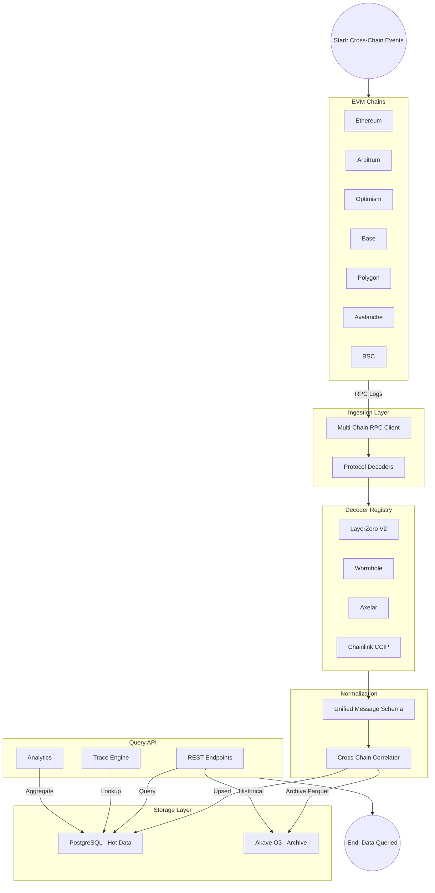
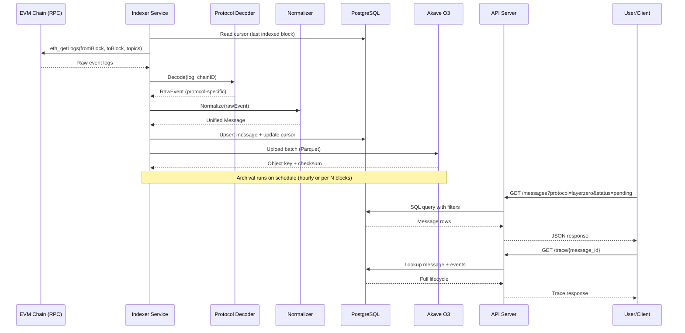

# CrossChain Archive: Detailed Technical Plan & Milestones

**Status**: Ready for review
**Contributor**: Patrick-Ehimen
**Date**: February 10, 2026
**Proposal Reference**: [PROPOSAL.md](./PROPOSAL.md)
**Note:** Open for potential collaborators

**CrossChain Archive is a unified indexer and archival system that ingests cross-chain bridge transactions and messages from multiple protocols (Wormhole, LayerZero, Axelar, CCIP), normalizes them into a common schema, stores hot data in PostgreSQL for fast queries, and archives immutable records to Akave O3 in Parquet format.**

## Brief Problem Statement

Cross-chain bridges and messaging protocols move billions of dollars across blockchains, but tracking this activity is fragmented:

- **No unified view** across protocols — each has its own explorer
- **Hard to trace end-to-end** — correlating source TX to destination TX requires manual effort
- **Data disappears** — RPC nodes prune old data, making historical analysis difficult
- **Forensics gaps** — when bridges are exploited, investigators lack comprehensive archives
- **No immutable record** — existing indexers run on centralized infrastructure

> There is a clear need for a **unified, immutable, and queryable archive** of cross-chain activity that validates **Akave O3** as the decentralized storage backend.

## Objective

Build a **cross-chain indexer and archive** that:

1. **Indexes** bridge transactions and messages from 4 protocols
2. **Normalizes** data into a unified schema for cross-protocol queries
3. **Correlates** source and destination transactions end-to-end
4. **Archives** all data immutably on Akave O3
5. **Exposes** a REST API for developers, researchers, and analytics platforms

## Platform Architecture



## Layer-to-Layer Task Flow



## High-Level Architecture

### Ingestion Layer (Go)

**A multi-chain RPC client that connects to EVM chains, subscribes to protocol-specific events, and feeds raw logs into protocol decoders for processing.**

**Core Capabilities:**

- **Multi-Chain Connectivity** — Connects to 7+ EVM chains via JSON-RPC using `go-ethereum` ethclient
- **Configurable Confirmation Depth** — Waits for N confirmations per chain before processing (e.g., 12 for Ethereum, 1 for Arbitrum)
- **Block Range Polling** — Fetches logs in configurable block chunks (default 1000) with cursor tracking
- **Rate Limiting & Retries** — Adaptive backoff for RPC calls, respects provider rate limits
- **Cursor Persistence** — Tracks last indexed block per chain per protocol in `indexer_cursors` table

### Decoder Registry

**A plugin-style decoder system where each protocol implements a common interface, allowing the indexer to decode events from any registered protocol.**

**Core Capabilities:**

- **Common Interface** — All decoders implement `Decoder` interface with `Protocol()`, `ContractAddresses()`, `EventTopics()`, `Decode()`
- **Protocol-Specific Parsing** — Each decoder knows its contract ABIs, event signatures, and data formats
- **Chain-Aware** — Decoders know which contract addresses to monitor on each chain
- **Extensible** — Adding a new protocol means implementing one interface and registering it

```go
type Decoder interface {
    Protocol() string
    ContractAddresses(chainID uint64) []common.Address
    EventTopics() []common.Hash
    Decode(log types.Log, chainID uint64) (*RawEvent, error)
}
```

**Protocol decoders and their target events:**

| Protocol | Source Event | Destination Event | Correlation Key |
|----------|------------|-------------------|-----------------|
| **LayerZero V2** | `PacketSent` | `PacketReceived` | GUID |
| **Wormhole** | `LogMessagePublished` | `TransferRedeemed` | (emitterChain, emitterAddr, sequence) |
| **Axelar** | `ContractCall` | `ContractCallApproved` → `Executed` | commandId |
| **CCIP** | `CCIPSendRequested` | `ExecutionStateChanged` | messageId |

### Normalization Layer

**Maps protocol-specific raw events into a unified message schema, enabling cross-protocol queries and consistent status tracking.**

**Unified Message Schema:**

```json
{
  "message_id": "0xabc123...",
  "protocol": "layerzero_v2",
  "type": "token_transfer",
  "source": {
    "chain_id": 1,
    "tx_hash": "0x123...",
    "block_number": 19000000,
    "timestamp": 1706000000,
    "sender": "0xSender..."
  },
  "destination": {
    "chain_id": 42161,
    "tx_hash": "0x456...",
    "block_number": 180000000,
    "timestamp": 1706000045,
    "receiver": "0xReceiver..."
  },
  "status": "executed",
  "payload": {
    "token": "0xUSDC...",
    "amount": "1000000000",
    "nonce": 42
  },
  "metadata": {
    "fee": "0.001",
    "relayer": "0xRelayer...",
    "gas_used": 150000,
    "latency_seconds": 45
  }
}
```

### Storage Layer

**Dual-storage strategy: PostgreSQL for fast queries on recent data, Akave O3 for immutable long-term archival.**

**PostgreSQL (hot data / queries):**

| Table | Key Columns | Purpose |
|-------|-------------|---------|
| `messages` | `message_id`, `protocol`, `type`, `status`, `created_at` | Core message record |
| `message_sources` | `message_id`, `chain_id`, `tx_hash`, `block_number`, `sender` | Source chain details |
| `message_destinations` | `message_id`, `chain_id`, `tx_hash`, `block_number`, `receiver` | Destination chain details |
| `message_payloads` | `message_id`, `token`, `amount`, `data`, `nonce` | Transfer payload |
| `message_metadata` | `message_id`, `fee`, `relayer`, `gas_used`, `latency_seconds` | Execution metadata |
| `indexer_cursors` | `chain_id`, `protocol`, `last_block`, `updated_at` | Resume state |

**Akave O3 (cold data / archive):**

```
crosschain-archive/
├── protocols/
│   ├── wormhole/{chain}/{year}-{month}.parquet
│   ├── layerzero/{chain}/{year}-{month}.parquet
│   ├── axelar/{chain}/{year}-{month}.parquet
│   └── ccip/{chain}/{year}-{month}.parquet
├── unified/
│   └── messages/{year}-{month}.parquet
├── aggregated/
│   ├── daily_volume.parquet
│   └── route_stats.parquet
└── manifests/
    └── index.json
```

### Query API (REST)

**RESTful API exposing indexed data with filtering, pagination, tracing, and analytics capabilities.**

**Core Endpoints:**

- `GET /messages/{message_id}` — Get message by ID
- `GET /messages?src_chain=1&dst_chain=42161&protocol=layerzero&status=pending` — Filter messages
- `GET /transactions/{tx_hash}/messages` — All messages in a transaction
- `GET /address/{addr}/history` — Cross-chain history for address
- `GET /trace/{message_id}` — Full end-to-end trace with all events
- `GET /protocols/{protocol}/stats` — Volume, latency, success rate
- `GET /routes/stats` — Popular routes, volume by chain pair

## Approach

We will build CrossChain Archive in **incremental, testable milestones**, starting with core infrastructure → single protocol pipeline → multi-protocol expansion → API layer → production hardening. Each milestone produces a working, demonstrable increment.

### Implementation Strategy

1. **Core infrastructure** — Project scaffold, DB schema, RPC + O3 connectivity
2. **First protocol pipeline** — LayerZero V2 end-to-end (ingest → normalize → store → archive)
3. **Protocol expansion** — Add Wormhole, Axelar, CCIP decoders with shared registry
4. **Query layer** — REST API with filtering, tracing, and analytics
5. **Hardening + docs** — Reorg handling, backfill, observability, comprehensive documentation

### Akave O3 Integration

Akave O3 serves as the **immutable archive layer**. We will use the Akave O3 SDK/API for object operations:

- `Upload` — Compressed Parquet batches of raw events and normalized messages
- `Download` — Retrieve archived data for historical queries
- `List` — Browse archived objects by prefix

> **Note:** Akave O3 handles durable, immutable storage. All query logic operates against PostgreSQL, with O3 as the archive fallback for historical data.

---

## Complete End-to-End Workflow

### Indexer Service Startup

1. **Service Initialization**
   - Go service starts, loads config (YAML + env vars)
   - PostgreSQL connection pool initialized via `pgx`
   - Akave O3 client initialized with credentials
   - Multi-chain RPC clients connect to configured endpoints

2. **Database Migration**
   - `golang-migrate` runs pending migrations on startup
   - Creates tables: `messages`, `message_sources`, `message_destinations`, `message_payloads`, `message_metadata`, `indexer_cursors`

3. **Indexing Loop Starts**
   - For each chain + protocol pair, reads cursor from `indexer_cursors`
   - Begins polling for new events from `cursor + 1` to latest confirmed block

### Event Ingestion Flow

1. **Log Fetching**
   - RPC client calls `eth_getLogs` with protocol contract addresses and event topics
   - Logs fetched in configurable block chunks (default 1000 blocks)

2. **Decoding**
   - Each log matched to the appropriate decoder via topic signature
   - Decoder parses ABI-encoded data into protocol-specific `RawEvent`

3. **Normalization & Correlation**
   - `RawEvent` mapped to unified `Message` schema
   - Source events create new messages with status `pending`
   - Destination events match existing messages via correlation key → status updated to `executed`
   - Latency computed when both timestamps available

4. **Storage**
   - Messages upserted to PostgreSQL
   - Cursor updated to latest processed block
   - On archival schedule: raw events serialized to Parquet, uploaded to Akave O3

**Example: LayerZero V2 Indexing**

```
1. eth_getLogs returns PacketSent event on Ethereum (chain 1)
2. LayerZero decoder extracts: GUID, srcEid, dstEid, sender, payload
3. Normalizer creates Message: {message_id: GUID, protocol: "layerzero_v2", status: "pending", source: {chain_id: 1, ...}}
4. Message inserted into PostgreSQL

... later ...

5. eth_getLogs returns PacketReceived event on Arbitrum (chain 42161) with same GUID
6. Decoder extracts: GUID, receiver, block, timestamp
7. Normalizer matches GUID → updates message: {status: "executed", destination: {chain_id: 42161, ...}, latency_seconds: 45}
8. Message updated in PostgreSQL
```

### API Query Flow

1. **User Submits Query**
   - Client calls `GET /messages?protocol=layerzero&status=pending&src_chain=1`

2. **Query Execution**
   - API server parses query params into SQL filters
   - PostgreSQL returns matching rows with pagination

3. **Response**

**`GET /messages?protocol=layerzero_v2&src_chain=1&limit=2`**

```json
{
  "data": [
    {
      "message_id": "0xabc123...",
      "protocol": "layerzero_v2",
      "type": "token_transfer",
      "status": "executed",
      "source": { "chain_id": 1, "tx_hash": "0x123...", "timestamp": 1706000000 },
      "destination": { "chain_id": 42161, "tx_hash": "0x456...", "timestamp": 1706000045 },
      "latency_seconds": 45
    }
  ],
  "pagination": {
    "cursor": "eyJpZCI6MTAwfQ==",
    "has_more": true
  }
}
```

**`GET /trace/0xabc123`**

```json
{
  "message_id": "0xabc123...",
  "protocol": "layerzero_v2",
  "status": "executed",
  "events": [
    {
      "type": "packet_sent",
      "chain_id": 1,
      "tx_hash": "0x123...",
      "block_number": 19000000,
      "timestamp": 1706000000,
      "details": { "sender": "0xSender...", "nonce": 42 }
    },
    {
      "type": "packet_received",
      "chain_id": 42161,
      "tx_hash": "0x456...",
      "block_number": 180000000,
      "timestamp": 1706000045,
      "details": { "receiver": "0xReceiver..." }
    }
  ],
  "latency_seconds": 45
}
```

---

## Milestones

### Milestone 1: Project Scaffolding & Core Infrastructure

**Goal**: Establish the project foundation — repository structure, build system, database schema, and working connections to Akave O3 and chain RPCs.

- [ ] Initialize Go module and project directory structure
- [ ] Set up `Makefile` with targets: `build`, `test`, `lint`, `migrate`, `run-indexer`, `run-api`
- [ ] Add `docker-compose.yml` for local PostgreSQL
- [ ] Configure CI with GitHub Actions (lint + unit tests)
- [ ] Implement config loading from YAML + environment variable overrides
- [ ] Design and apply PostgreSQL schema via `golang-migrate` migrations
- [ ] Implement multi-chain RPC client with configurable confirmation depth and rate limiting
- [ ] Implement Akave O3 client wrapper (`Upload`, `Download`, `List`) with retry logic
- [ ] Write seed SQL and unit tests for RPC and O3 clients

**Deliverables:**
- Buildable Go project with CI passing
- PostgreSQL schema applied via migrations
- Working RPC connections to at least 2 chains (Ethereum + Arbitrum testnets)
- Working Akave O3 upload/download verified with a test file
- `docker-compose up` spins up a working local dev environment

**Acceptance Criteria:**
- `make build` compiles without errors
- `make test` passes all unit tests
- `make migrate` applies schema to a fresh PostgreSQL instance
- Indexer binary starts, connects to RPCs, and logs current block heights
- A test Parquet file can be uploaded to and retrieved from Akave O3

---

### Milestone 2: First Protocol Decoder — LayerZero V2

**Goal**: Index real cross-chain messages from LayerZero V2, store in PostgreSQL, and archive raw events to Akave O3. This validates the full pipeline end-to-end.

- [ ] Implement LayerZero V2 ABI parsing (`PacketSent`, `PacketReceived`, `OFTSent`)
- [ ] Map LayerZero endpoint IDs to EVM chain IDs
- [ ] Implement core indexing loop (cursor read → fetch logs → decode → normalize → upsert → update cursor)
- [ ] Implement cross-chain correlation via GUID matching (`PacketSent` → `pending`, `PacketReceived` → `executed`)
- [ ] Compute latency when both source and destination timestamps are known
- [ ] Serialize raw events to Parquet format using `parquet-go`
- [ ] Implement O3 archival pipeline: batch upload to `protocols/layerzero/{chain}/{year}-{month}.parquet`
- [ ] Write manifest file (`manifests/index.json`) listing archived files with row counts and time ranges
- [ ] Unit tests for decoder with sample ABI-encoded log data
- [ ] Integration test: index events from testnet, verify messages in PostgreSQL and Parquet on O3

**Deliverables:**
- LayerZero V2 decoder that correctly parses all target events
- Working ingestion loop indexing messages from at least 2 chains
- Messages in PostgreSQL with correct source ↔ destination correlation
- Raw events archived to Akave O3 in Parquet format
- Test suite covering decoder and pipeline logic

**Acceptance Criteria:**
- Indexer picks up a real `PacketSent` event and creates a `pending` message in the database
- Corresponding `PacketReceived` event updates message to `executed` with destination details
- Parquet file on Akave O3 contains indexed events and is readable
- Cursor survives restarts: no duplicates on re-run
- Unit test coverage >80% on decoder and normalization code

---

### Milestone 3: Multi-Protocol Expansion

**Goal**: Add decoders for Wormhole, Axelar, and Chainlink CCIP. All four protocols indexed into the same unified schema.

- [ ] Implement Wormhole decoder (`LogMessagePublished`, `TransferRedeemed`) with (emitterChain, emitterAddr, sequence) correlation
- [ ] Implement Axelar decoder (`ContractCall`, `ContractCallApproved`, `Executed`) with commandId correlation
- [ ] Implement CCIP decoder (`CCIPSendRequested`, `ExecutionStateChanged`) with messageId correlation
- [ ] Map Wormhole chain IDs and CCIP chain selectors to standard EVM chain IDs
- [ ] Map Axelar chain name strings to chain IDs
- [ ] Refactor to decoder registry pattern: register all decoders via `Decoder` interface
- [ ] Verify unified schema consistency across all 4 protocols
- [ ] Unit tests for each new decoder with sample encoded events
- [ ] Cross-protocol integration test: index from all 4 protocols, verify unified output
- [ ] Regression tests ensuring LayerZero decoder is unaffected

**Deliverables:**
- Working decoders for Wormhole, Axelar, and CCIP
- Decoder registry with clean plugin interface
- All 4 protocols indexing and correlating messages correctly
- Unified messages queryable in PostgreSQL regardless of protocol
- Per-protocol Parquet archives on Akave O3

**Acceptance Criteria:**
- Each decoder correctly parses at least 3 sample events (unit tested)
- Indexer with all 4 protocols enabled indexes messages from each
- Cross-chain correlation works for all protocols: source + destination linked, status updated
- Adding a new decoder requires only implementing `Decoder` interface and registering it
- All tests pass, no regressions in existing functionality

---

### Milestone 4: REST API & Query Layer

**Goal**: Expose indexed data through a REST API with filtering, tracing, and analytics for developers, researchers, and analytics platforms.

- [ ] Implement HTTP server using Go router (`chi` or `echo`) with graceful shutdown
- [ ] Implement `GET /messages/{message_id}` — full message with source, destination, payload, metadata
- [ ] Implement `GET /messages` — with query params: `src_chain`, `dst_chain`, `protocol`, `status`, `type`, `from_time`, `to_time`, `sender`, `receiver`; cursor pagination (default 50, max 200)
- [ ] Implement `GET /transactions/{tx_hash}/messages` — all messages in a transaction
- [ ] Implement `GET /address/{address}/history` — cross-chain history for an address
- [ ] Implement `GET /trace/{message_id}` — full lifecycle with all intermediate events
- [ ] Implement `GET /protocols/{protocol}/stats` — total messages, success rate, average latency, volume (24h/7d/30d)
- [ ] Implement `GET /routes/stats` — top routes by message count and volume
- [ ] Implement `GET /stats/summary` — aggregate stats across all protocols
- [ ] Implement `GET /health` — service health check
- [ ] Write OpenAPI 3.0 specification
- [ ] Add database indexes to support query patterns
- [ ] Implement query result caching for analytics endpoints (60s TTL)
- [ ] API endpoint tests with seeded test database
- [ ] Load test key endpoints to verify `<500ms` response time

**Deliverables:**
- Running API server with all specified endpoints
- OpenAPI 3.0 specification document
- Query performance within target (<500ms for single lookups)
- API test suite with seeded data
- API usage examples in documentation

**Acceptance Criteria:**
- All endpoints return correct data matching the unified schema
- Pagination and filtering work correctly across all list endpoints
- Trace endpoint returns full event lifecycle for a message
- Analytics endpoints return correct aggregations
- API responds within 500ms for single lookups (on seeded DB with 100K+ messages)
- OpenAPI spec is accurate and can generate valid client code

---

### Milestone 5: Production Hardening & Documentation

**Goal**: Make the system resilient to real-world conditions and produce comprehensive documentation.

- [ ] Implement reorg detection (track block hashes, verify parent hash continuity, rewind cursor on fork)
- [ ] Implement backfill CLI: `indexer backfill --chain=1 --protocol=layerzero --from=19000000 --to=19500000`
- [ ] Implement RPC failover: multiple endpoints per chain, automatic failover
- [ ] Add structured logging with levels (debug, info, warn, error) via `zerolog`
- [ ] Add Prometheus metrics: `indexed_blocks_total`, `indexed_messages_total`, `rpc_request_duration_seconds`, `akave_upload_duration_seconds`, `api_request_duration_seconds`, `reorg_detected_total`
- [ ] Implement scheduled O3 archival with Snappy-compressed Parquet and checksum verification
- [ ] Implement O3 read-back for historical API queries beyond hot storage window
- [ ] Write Architecture Overview with system diagrams
- [ ] Write Setup & Deployment Guide (Docker Compose local dev + production considerations)
- [ ] Write API Reference with usage examples (generated from OpenAPI spec)
- [ ] Write Protocol Addition Guide (step-by-step for new `Decoder` implementation)
- [ ] Write Data Schema Reference (PostgreSQL schema, O3 layout, Parquet schema)
- [ ] End-to-end test: indexer + API against forked testnet, query via API, verify O3 archive
- [ ] CI pipeline: lint → unit tests → integration tests → build Docker images
- [ ] Test coverage report (target: >70% overall, >85% for decoders)

**Deliverables:**
- Reorg handling working and tested
- Backfill CLI tool
- Prometheus metrics endpoint
- RPC failover logic
- Complete documentation suite
- Final CI pipeline with all test stages
- Docker images for indexer and API services

**Acceptance Criteria:**
- Simulated reorg is detected and handled correctly — no stale or duplicate messages
- Backfill tool successfully indexes a specified block range, idempotently
- Prometheus metrics display meaningful data
- RPC failover works without data loss when primary endpoint goes down
- Documentation sufficient for a new developer to set up, run, query, and extend the project
- CI pipeline passes end-to-end on every push to main
- Docker images build and run successfully

---

## Milestone Summary

| Milestone | Focus | Key Outcome |
|-----------|-------|-------------|
| **M1** | Project Scaffolding & Core Infrastructure | Buildable project, DB schema, RPC + O3 connections working |
| **M2** | First Protocol — LayerZero V2 | Full pipeline validated: ingest → normalize → store → archive |
| **M3** | Multi-Protocol Expansion | All 4 protocols (Wormhole, LayerZero, Axelar, CCIP) indexing |
| **M4** | REST API & Query Layer | Full query API with filtering, tracing, and analytics |
| **M5** | Production Hardening & Docs | Reorg handling, backfill, observability, comprehensive docs |

## Tech Stack

| Layer | Stack |
|-------|-------|
| **Language** | Go 1.22+ |
| **Ethereum Client** | go-ethereum (ethclient, abi) |
| **Database** | PostgreSQL 15+ |
| **SQL Driver** | pgx + pgxpool |
| **Migrations** | golang-migrate |
| **HTTP Router** | chi or echo |
| **Parquet** | parquet-go |
| **Storage** | Akave O3 |
| **Config** | Viper (YAML + env) |
| **Logging** | zerolog |
| **Metrics** | Prometheus client_golang |
| **CI** | GitHub Actions |
| **Containers** | Docker, Docker Compose |

**Key deps:** `go-ethereum`, `pgx`, `golang-migrate`, `parquet-go`, `chi/echo`, `viper`, `zerolog`, `prometheus/client_golang`

## Project Layout

```
crosschain-archive/
├── cmd/
│   ├── indexer/              # Indexer service entrypoint (main.go)
│   └── api/                  # API service entrypoint (main.go)
├── internal/
│   ├── chain/                # Multi-chain RPC client, block poller
│   ├── decoder/              # Decoder interface + registry
│   │   ├── registry.go       # Decoder registration
│   │   ├── layerzero/        # LayerZero V2 decoder
│   │   ├── wormhole/         # Wormhole decoder
│   │   ├── axelar/           # Axelar decoder
│   │   └── ccip/             # Chainlink CCIP decoder
│   ├── normalizer/           # Raw event → unified message mapping
│   ├── correlator/           # Cross-chain message matching
│   ├── storage/
│   │   ├── postgres/         # PostgreSQL repository (queries, upserts)
│   │   └── akave/            # Akave O3 client wrapper
│   ├── archiver/             # Parquet serialization + O3 upload scheduling
│   └── api/                  # HTTP handlers, middleware, routes
├── migrations/               # SQL migration files (001_init.up.sql, etc.)
├── configs/                  # YAML config templates
├── scripts/                  # docker-compose.yml, seed data, dev tooling
├── docs/                     # Architecture, API reference, guides
├── tests/                    # Integration & e2e tests
├── Makefile
├── Dockerfile
├── PLAN.md
├── PROPOSAL.md
└── README.md
```

## Dependencies & Risks

### External Dependencies
- **Akave O3 SDK/API** — Access to O3 storage for upload/download; SDK changes may require wrapper updates
- **Chain RPC Providers** — Reliable RPC access for 7 chains; rate limits or downtime could slow indexing
- **Protocol Contract ABIs** — Stable contract interfaces for all 4 protocols; upgrades may require decoder updates

### Risks & Mitigations

| Risk | Impact | Mitigation |
|------|--------|------------|
| RPC rate limiting slows indexing | Medium | Multiple RPC providers per chain, adaptive backoff, batch log fetching |
| Protocol contract upgrades break decoders | Medium | Decoder registry isolates changes; monitor protocol changelogs |
| Akave O3 API changes | Low | Wrapper layer abstracts O3 interactions; pinned SDK version |
| Cross-chain correlation mismatches | High | Extensive unit tests with real event data; manual verification against protocol explorers |
| High event volume exceeds processing capacity | Medium | Batch processing, configurable parallelism, horizontal scaling by chain |

## Success Criteria

- Successfully indexes messages from **4 protocols** (Wormhole, LayerZero, Axelar, CCIP)
- Supports **5+ chains** (Ethereum, Arbitrum, Base, Optimism, Polygon)
- **End-to-end tracing** correctly correlates source and destination transactions
- Historical data queryable from **Akave O3** archives
- API response time **< 500ms** for single message lookup
- **Documentation** sufficient for new contributors to add protocols
- Demonstrates clear value for **cross-chain data archival** on Akave O3

## References

- **Akave O3 Console**: https://console.akave.ai/
- **Wormhole Docs**: https://docs.wormhole.com/
- **LayerZero Docs**: https://docs.layerzero.network/
- **Axelar Docs**: https://docs.axelar.dev/
- **Chainlink CCIP Docs**: https://docs.chain.link/ccip
